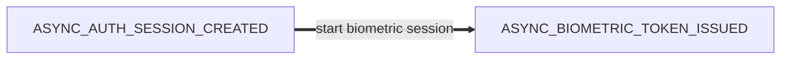

# Session State Machine

The auth session for the async backend follows a forward-only state machine, as illustrated below.

```mermaid
flowchart LR
    ASYNC_AUTH_SESSION_CREATED == start biometric session ==> ASYNC_BIOMETRIC_TOKEN_ISSUED
```