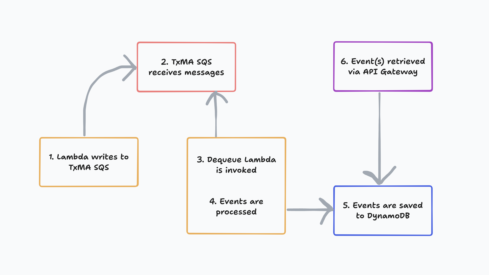

# Dequeue events

## Contents
- [Overview](#overview)
- [Dependencies](#dependencies)
- [Dequeue events flow](#dequeue-events-flow)
- [How it works](#how-it-works)
  - [Backend API SQS queue](#backend-api-sqs-queue)
  - [Dequeue Lambda](#dequeue-lambda)
    - [Lambda polls SQS for messages](#lambda-polls-sqs-for-messages)
    - [Event validation](#event-validation)
    - [Storing events in DynamoDB](#storing-events-in-dynamodb)
    - [Returning `BatchItemFailures`](#returning-batchitemfailures)
  - [Retrieving events](#retrieving-events)

## Overview

##### Context

The async backend sends audit events to SQS as part of an asynchronous
pattern. Tests for this pattern may need to inject messages into a queue or
assert against a message on a queue. However, it is not always possible to test
responses from external interfaces of a system that has an asynchronous
architecture. This can be tested manually, but it does not guarantee the code
will work when it is part of a deployment pipeline. The Dequeue events
functionality provides an automated test solution.

##### The solution

The Dequeue events functionality provides an API Gateway for use in testing to
query and retrieve events from DynamoDB.

The purpose of the Dequeue functionality is to switch from manual testing to an automated
testing strategy, providing a way to assert that TxMA audit events sent to the
backend-api SQS queue are 1) successfully added to the queue, and 2) are in the
correct shape.

It achieves this by writing events to a database, so that they can later be
retrieved and tested against, adding the ability to test two existing
patterns within the async repo architecture:

- TxMA audit events sent to SQS
-  Messages sent to the following during handback:
    - Vendor processing queue
    - Outbound queue for IPV

## How it works



> ###### Dequeue events flow

##

### Backend API SQS queue

1. #### Backend API writes to TxMA SQS

##

### [Dequeue Lambda](./dequeueHandler.ts)

2. #### Lambda polls SQS for messages

The Dequeue Lambda receives events in batches when new events are added to the
backend-api SQS queue. This is done using an [`EventSourceMapping` AWS resource](https://docs.aws.amazon.com/AWSCloudFormation/latest/UserGuide/aws-resource-lambda-eventsourcemapping.html)
(an example can be found in the [SAM template](../../../infra/dequeue/function.yaml)).

> Note: the number of TxMA events that are sent in a batch can be configuring by
specifying the `BatchSize` on the `EventSourceMapping` resource.

3. #### Event validation

The Lambda processes each event in the batch. If event validation fails, an
error is logged and the Lambda will then skip to the next event to be processed
if one exists.

4. #### Storing events in DynamoDB

The Lambda saves the event to the Events table via a DynamoDB `PutItemCommand`.
This call contains the following `Item` schema:

```typescript
const putItemCommandInput: PutItemCommandInput = {
  TableName: env.EVENTS_TABLE_NAME,
  Item: marshall({
    pk: `SESSION#${sessionId}`,
    sk: `TXMA#EVENT_NAME#${eventName}#TIMESTAMP#${timestamp}`,
    event: record.body,
    timeToLiveInSeconds,
  }),
};
```

> ###### Partition Key and Sort Key
> The Partition Key (PK) and Sort Key (SK) make up the composite key use to
> query the Events table.

An error writing to DynamoDB results in a message being logged and the
`messageId` from the current record being pushed to a `batchItemFailures` array.

If storing the event in the Events table is successful, the `event_name` and
`session_id` from that event is pushed to a `processedMessages` array, which is
logged once all events have been processed.

5. #### Returning `BatchItemFailures`

An object with `batchItemFailures` is returned from the Dequeue Lambda.
This puts events that failed to be written to DynamoDB back into the SQS queue
to be reprocessed.

> Note: `bactchItemFailures` is an array and can be empty when returned

Records being worked on by the Dequeue Lambda are considered 'in-fight' and
cannot be processed by other consumers of the backend-api SQS queue due to the
[visibility timeout](https://docs.aws.amazon.com/AWSSimpleQueueService/latest/SQSDeveloperGuide/sqs-visibility-timeout.html).

##

### Events API

6. #### Retrieving events

Events successfully written to the Events table can be retrieved using
the `/events` endpoint on the test-resources
[Events API](../../../openApiSpecs/events-spec.yaml)
