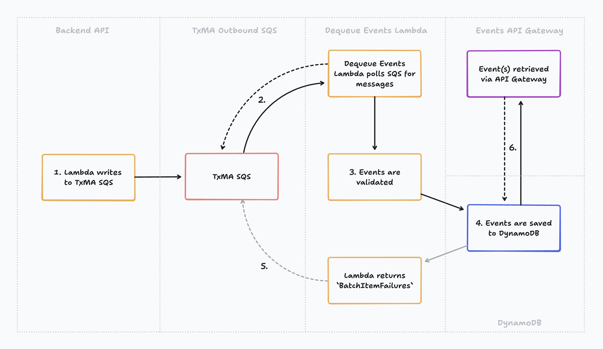

# Dequeue events

## Contents
- [Overview](#overview)
- [Dependencies](#dependencies)
- [Dequeue events flow](#dequeue-events-flow)
- [How it works](#how-it-works)
  - [Backend API SQS queue](#backend-api-sqs-queue)
  - [Dequeue Lambda](#dequeue-lambda)
    - [Lambda polls SQS for messages](#lambda-polls-sqs-for-messages)
    - [Event validation](#event-validation)
    - [Storing events in DynamoDB](#storing-events-in-dynamodb)
    - [Returning `BatchItemFailures`](#returning-batchitemfailures)
  - [Retrieving events](#retrieving-events)

## Overview

#### Context

The backend API lambdas send audit events to SQS. A TxMA lambda (from a separate
team's AWS account) polls the SQS for messages before they eventually appear in
Splunk.

It is not possible to test that these events have been sent to the queue via API
tests on the async backend's Session API, as these events trigger the start of
an asynchronous flow.

Events can be tested manually by inspecting the queue; however, it is not
feasible to test events for every deployment.

The Dequeue events functionality provides an automated test solution that can be
used to replace the manual test effort and therefore can be run as part of
regression suites in deployment pipelines.

#### The solution

The Dequeue events functionality provides an API Gateway for use in testing to
query and retrieve events that are sent to the TxMA SQS.

The purpose of the Dequeue functionality is to switch from manual testing to an
automated testing strategy, providing a way to assert that TxMA audit events
sent to the backend API SQS queue are 1) successfully added to the queue, and 2)
are in the correct shape.

It achieves this by polling SQS with a lambda and when messages are present, the
lambda processes and writes the events into DynamoDB, so that they can later be
retrieved and tested against with an API.

## How it works



> ###### Dequeue events flow

##

### Backend API SQS queue

1. #### Backend API writes to TxMA SQS

##

### [Dequeue Lambda](./dequeueHandler.ts)

2. #### Lambda polls SQS for messages

The Dequeue Lambda receives events in batches when new events are added to the
backend API SQS queue. This is done using an
[`EventSourceMapping` AWS resource](https://docs.aws.amazon.com/AWSCloudFormation/latest/UserGuide/aws-resource-lambda-eventsourcemapping.html)
(an example can be found in the [SAM template](../../../infra/dequeue/function.yaml)).

> Note: the number of TxMA events that are sent in a batch can be configuring by
specifying the `BatchSize` on the `EventSourceMapping` resource.

3. #### Event validation

The Lambda processes each event in the batch, checking that the `event_name`
exists in either the `allowedTxmaEventNames` or
`allowedTxmaEventNamesWithoutSessionId` array. If event validation fails, an
error is logged and the Lambda will then skip to the next event to be processed
if one exists.

4. #### Storing events in DynamoDB

The Lambda saves the event to the Events table via a DynamoDB `PutItemCommand`.
This call contains the following `Item` schema:

```typescript
const putItemCommandInput: PutItemCommandInput = {
  TableName: env.EVENTS_TABLE_NAME,
  Item: marshall({
    pk: `SESSION#${sessionId}`,
    sk: `TXMA#EVENT_NAME#${eventName}#TIMESTAMP#${timestamp}`,
    event: record.body,
    timeToLiveInSeconds,
  }),
};
```

> ###### Partition Key and Sort Key
> The Partition Key (PK) and Sort Key (SK) make up the composite key used to
> query the Events table. The structure of the keys allows for multiple types of
> event and event identifier, keeping the schema flexible for future use cases.

If a `session_id` is not present in the SQS message, it is saved to Dynamo with
a value of `UNKNOWN`. This is to allow for events that do not contain a
`session_id` in the event schema.

5. #### Returning `BatchItemFailures`

If storing the event in the Events table is successful, the `event_name` and
`session_id` from that event is pushed to a `processedMessages` array, which is
logged once all events have been processed.

If there is an error writing to DynamoDB, a message is logged and the
`messageId` from the current `Record` (the batch item containing a payload,
in this case, an audit event) is pushed to a `batchItemFailures`
array.

The `batchItemFailures` array is then returned in an object from the Dequeue
Lambda. This puts the events that failed to be written to DynamoDB back into the
SQS queue to be reprocessed.

> Note: `batchItemFailures` is an array and can be empty when returned.

Batch items being worked on by the Dequeue Lambda are considered 'in-fight' and
cannot be processed by other consumers of the backend API SQS queue due to the
[visibility timeout](https://docs.aws.amazon.com/AWSSimpleQueueService/latest/SQSDeveloperGuide/sqs-visibility-timeout.html).

##

### Events API

6. #### Retrieving events

Events successfully written to the Events table can be retrieved using
the `GET /events` endpoint on the test-resources
[Events API](../../../openApiSpecs/events-spec.yaml)
