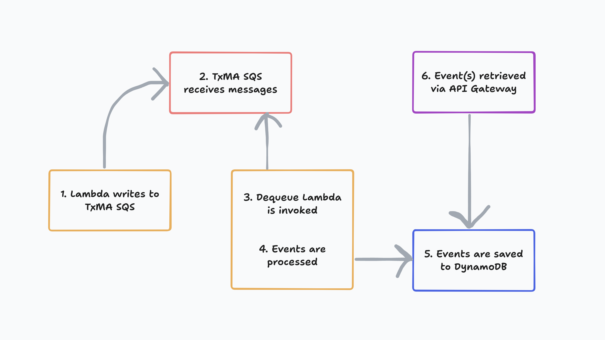

# Dequeue events

## Contents
- [Overview](#overview)
- [Dependencies](#dependencies)
- [Dequeue events flow](#dequeue-events-flow)
- [How it works](#how-it-works)
  - [Backend API SQS queue](#backend-api-sqs-queue)
  - [Dequeue Lambda](#dequeue-lambda)
    - [Lambda invocation](#lambda-invocation)
    - [Processing events](#processing-events)
    - [Storing events in DynamoDB](#storing-events-in-dynamodb)
    - [`BatchItemFailures`](#batchitemfailures)
- [Troubleshooting](#troubleshooting)

## Overview

#### What problem does this solve?

TxMA is a queue based system where the Async Backend application sends audit
events to SQS, which then triggers a Lambda within an AWS account. Though the
flow of an event can be tested manually, it is not possible to do the same with
unit testing. The Dequeue events functionality provides an automated solution.

#### Why do we need to test this?

The purpose of the Dequeue flow is to switch from manual testing to an automated
testing strategy, providing a way to assert that TxMA audit events sent to the
backend-api SQS queue are 1) successfully added to the queue, and 2) are in the
correct shape.

It achieves this by writing events to a database, so that they can later be
retrieved and tested against, adding the ability to test two existing
patterns within the Async repo architecture:

- TxMA audit events sent to SQS
-  Messages sent to the following during handback:
    - Vendor processing queue
    - Outbound queue for IPV

#### How does it work?

To enable assertions on audit events, this test harness uses an AWS resource to
map a Lambda function to an SQS queue. An event triggers the Lambda to pull one
or more *`Records` from the queue to process and store in an Events table in
DynamoDB.

> *Note: a `Record` is the data structure that contains a payload, e.g., an
**audit event**.

## How it works



> ###### Dequeue events flow

##

### Backend API SQS queue

1. #### Writing to TxMA SQS

The first step in the Dequeue events flow happens when a TxMA audit event is
sent to the backend-api SQS queue. This can be done manually in the AWS console
and by calling any Lambda, in a deployed backend-api stack, that pushes a TxMA
event to SQS.

2. #### Async Backend API TxMA SQS queue
Once events reach SQS, they are then pulled off of the queue by the Dequeue
Lambda to be processed.

##

### [Dequeue Lambda](./dequeueHandler.ts)

3. #### Lambda invocation

The Dequeue Lambda receives an event when a new event is added to the
backend-api SQS queue. This is done using an [`EventSourceMapping` AWS resource](https://docs.aws.amazon.com/AWSCloudFormation/latest/UserGuide/aws-resource-lambda-eventsourcemapping.html).

4. #### Processing events

A new event is sent from the backend-api SQS queue to the Dequeue Lambda.
Multiple TxMA events can be sent, in a `Records` array, by configuring the
`BatchSize` on the `EventSourceMapping` resource (an example can be found in the
[SAM template](../../../infra/dequeue/function.yaml)).

Each Record is processed individually with an initial check that logs if there
is an error retrieving the event from the Record. The Lambda will then skip to
the next event to be processed if there is one.

5. #### Storing events in DynamoDB

An event that has passed the previous check is then sent to the Events
table via a DynamoDB `PutItemCommand`. This call contains the following `Item`
schema:

```typescript
const putItemCommandInput: PutItemCommandInput = {
  TableName: env.EVENTS_TABLE_NAME,
  Item: marshall({
    pk: `SESSION#${sessionId}`,
    sk: `TXMA#EVENT_NAME#${eventName}#TIMESTAMP#${timestamp}`,
    event: record.body,
    timeToLiveInSeconds,
  }),
};
```

> ###### Partition Key and Sort Key
> The Partition Key (PK) and Sort Key (SK) make up the composite key use to
> query the Events table.

An error writing to DynamoDB results in a message being logged and the
`messageId` from the current record being pushed to a `batchItemFailures` array.

If storing the event in the Events table is successful, the `event_name` and
`session_id` from that event is pushed to a `processedMessages` array, which is
logged once all events have been processed.

#### `BatchItemFailures`

An object with `batchItemFailures`, if any, is returned from the Dequeue Lambda.
This puts events that failed to be written to DynamoDB back into the SQS queue
to be reprocessed.

Records being worked on by the Dequeue Lambda are considered 'in-fight' and
cannot be processed by other consumers of the backend-api SQS queue due to the
[visibility timeout](https://docs.aws.amazon.com/AWSSimpleQueueService/latest/SQSDeveloperGuide/sqs-visibility-timeout.html).

6. #### Retrieving events

Events successfully written to the Events table can be retrieved using
the `/events` endpoint on the test-resources
[Events API](../../../openApiSpecs/events-spec.yaml)

## Troubleshooting

#### Event registration

#### Test setup

#### DynamoDB record
